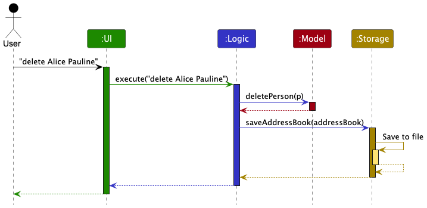
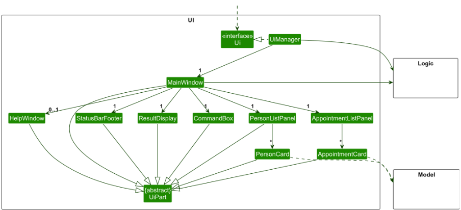
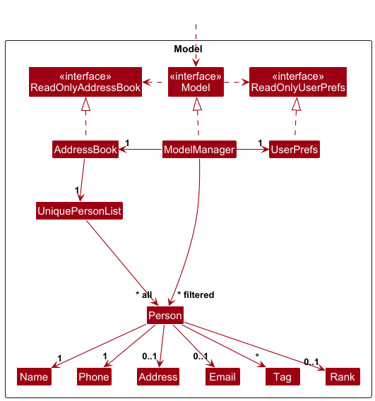
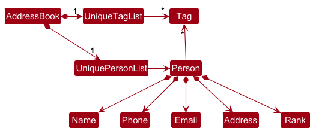

## Table of Contents
1. [Acknowledgements](#acknowledgements)
2. [Setting up, getting started](#setting-up-getting-started)
3. [Design](#design)
    1. [Architecture](#architecture)
    2. [UI component](#ui-component)
    3. [Logic component](#logic-component)
    4. [Model component](#model-component)
    5. [Storage component](#storage-component)
    6. [Common classes](#common-classes)
4. [Implementation](#implementation)
    1. [Proposed Undo/redo feature](#proposed-undoredo-feature)
    2. [Proposed Data archiving](#proposed-data-archiving)
5. [Documentation, logging, testing, configuration, dev-ops](#documentation-logging-testing-configuration-dev-ops)
    1. [Documentation guide](Documentation.md)
    2. [Testing guide](Testing.md)
    3. [Logging guide](Logging.md)
    4. [Configuration guide](Configuration.md)
    5. [DevOps guide](DevOps.md)
6. [Appendix: Requirements](#appendix-requirements)
    1. [Product scope](#product-scope)
    2. [User stories](#user-stories)
    3. [Use cases](#use-cases)
7. [Appendix: Instructions for manual testing](#appendix-instructions-for-manual-testing)
    1. [Launch and shutdown](#launch-and-shutdown)
    2. [Deleting a person](#deleting-a-person)
    3. [Saving data](#saving-data)

--------------------------------------------------------------------------------------------------------------------

## **Acknowledgements**

* {list here sources of all reused/adapted ideas, code, documentation, and third-party libraries -- include links to the
  original source as well}

[Back to table of contents](#table-of-contents)

--------------------------------------------------------------------------------------------------------------------

## **Setting up, getting started**

Refer to the guide [_Setting up and getting started_](SettingUp.md).

[Back to table of contents](#table-of-contents)

--------------------------------------------------------------------------------------------------------------------

## **Design**

<div markdown="span" class="alert alert-primary">

:bulb: **Tip:** The `.puml` files used to create diagrams are in this document `docs/diagrams` folder. Refer to the [
_PlantUML Tutorial_ at se-edu/guides](https://se-education.org/guides/tutorials/plantUml.html) to learn how to create
and edit diagrams.
</div>

### Architecture


The ***Architecture Diagram*** given above explains the high-level design of the App.

Given below is a quick overview of main components and how they interact with each other.

**Main components of the architecture**

**`Main`** (consisting of classes [
`Main`](https://github.com/se-edu/addressbook-level3/tree/master/src/main/java/seedu/address/Main.java) and [
`MainApp`](https://github.com/se-edu/addressbook-level3/tree/master/src/main/java/seedu/address/MainApp.java)) is in
charge of the app launch and shut down.

* At app launch, it initializes the other components in the correct sequence, and connects them up with each other.
* At shut down, it shuts down the other components and invokes cleanup methods where necessary.

The bulk of the app's work is done by the following four components:

* [**`UI`**](#ui-component): The UI of the App.
* [**`Logic`**](#logic-component): The command executor.
* [**`Model`**](#model-component): Holds the data of the App in memory.
* [**`Storage`**](#storage-component): Reads data from, and writes data to, the hard disk.

[**`Commons`**](#common-classes) represents a collection of classes used by multiple other components.

**How the architecture components interact with each other**

The *Sequence Diagram* below shows how the components interact with each other for the scenario where the user issues
the command `delete Alice Pauline`.



Each of the four main components (also shown in the diagram above),

* defines its *API* in an `interface` with the same name as the Component.
* implements its functionality using a concrete `{Component Name}Manager` class (which follows the corresponding API
  `interface` mentioned in the previous point.

For example, the `Logic` component defines its API in the `Logic.java` interface and implements its functionality using
the `LogicManager.java` class which follows the `Logic` interface. Other components interact with a given component
through its interface rather than the concrete class (reason: to prevent outside component's being coupled to the
implementation of a component), as illustrated in the (partial) class diagram below.


The sections below give more details of each component.

[Back to table of contents](#table-of-contents)

### UI component

The **API** of this component is specified in [
`Ui.java`](https://github.com/se-edu/addressbook-level3/tree/master/src/main/java/seedu/address/ui/Ui.java)



The UI consists of a `MainWindow` that is made up of parts e.g.`CommandBox`, `ResultDisplay`, `PersonListPanel`,
`StatusBarFooter` etc. All these, including the `MainWindow`, inherit from the abstract `UiPart` class which captures
the commonalities between classes that represent parts of the visible GUI.

The `UI` component uses the JavaFx UI framework. The layout of these UI parts are defined in matching `.fxml` files that
are in the `src/main/resources/view` folder. For example, the layout of the [
`MainWindow`](https://github.com/se-edu/addressbook-level3/tree/master/src/main/java/seedu/address/ui/MainWindow.java)
is specified in [
`MainWindow.fxml`](https://github.com/se-edu/addressbook-level3/tree/master/src/main/resources/view/MainWindow.fxml)

The `UI` component,

* executes user commands using the `Logic` component.
* listens for changes to `Model` data so that the UI can be updated with the modified data.
* keeps a reference to the `Logic` component, because the `UI` relies on the `Logic` to execute commands.
* depends on some classes in the `Model` component, as it displays `Person` object residing in the `Model`.

[Back to table of contents](#table-of-contents)

### Logic component

**API** : [
`Logic.java`](https://github.com/se-edu/addressbook-level3/tree/master/src/main/java/seedu/address/logic/Logic.java)

Here's a (partial) class diagram of the `Logic` component:


The sequence diagram below illustrates the interactions within the `Logic` component, taking `execute("delete Alice Pauline")` API
call as an example.


<div markdown="span" class="alert alert-info">:information_source: **Note:** The lifeline for `DeleteCommandParser` should end at the destroy marker (X) but due to a limitation of PlantUML, the lifeline continues till the end of diagram.
</div>

How the `Logic` component works:

1. When `Logic` is called upon to execute a command, it is passed to an `AddressBookParser` object which in turn creates
   a parser that matches the command (e.g., `DeleteCommandParser`) and uses it to parse the command.
1. This results in a `Command` object (more precisely, an object of one of its subclasses e.g., `DeleteCommand`) which
   is executed by the `LogicManager`.
1. The command can communicate with the `Model` when it is executed (e.g. to delete a person).<br>
   Note that although this is shown as a single step in the diagram above (for simplicity), in the code it can take
   several interactions (between the command object and the `Model`) to achieve.
1. The result of the command execution is encapsulated as a `CommandResult` object which is returned back from `Logic`.

Here are the other classes in `Logic` (omitted from the class diagram above) that are used for parsing a user command:


How the parsing works:

* When called upon to parse a user command, the `AddressBookParser` class creates an `XYZCommandParser` (`XYZ` is a
  placeholder for the specific command name e.g., `AddCommandParser`) which uses the other classes shown above to parse
  the user command and create a `XYZCommand` object (e.g., `AddCommand`) which the `AddressBookParser` returns back as a
  `Command` object.
* All `XYZCommandParser` classes (e.g., `AddCommandParser`, `DeleteCommandParser`, ...) inherit from the `Parser`
  interface so that they can be treated similarly where possible e.g, during testing.

[Back to table of contents](#table-of-contents)

### Model component

**API** : [
`Model.java`](https://github.com/se-edu/addressbook-level3/tree/master/src/main/java/seedu/address/model/Model.java)




The `Model` component,

* stores the address book data i.e., all `Person` objects (which are contained in a `UniquePersonList` object) and 
  all `Appointment` objects (which are contained in a `UniqueAppointmentList` object).
* stores the currently 'selected' `Person` objects (e.g., results of a search query) as a separate _filtered_ list which
  is exposed to outsiders as an unmodifiable `ObservableList<Person>` that can be 'observed' e.g. the UI can be bound to
  this list so that the UI automatically updates when the data in the list change.
* stores the currently selected `Appointment` objects as a seperate _filtered_ list which
  is exposed to outsiders as an unmodifiable `ObservableList<Appointment>` that can be 'observed'
* stores a `UserPref` object that represents the user’s preferences. This is exposed to the outside as a
  `ReadOnlyUserPref` objects.
* does not depend on any of the other three components (as the `Model` represents data entities of the domain, they
  should make sense on their own without depending on other components)

<div markdown="span" class="alert alert-info">:information_source: **Note:** An alternative (arguably, a more OOP) model is given below. It has a `Tag` list in the `AddressBook`, which `Person` references. This allows `AddressBook` to only require one `Tag` object per unique tag, instead of each `Person` needing their own `Tag` objects.<br>



</div>

[Back to table of contents](#table-of-contents)

### Storage component

**API** : [
`Storage.java`](https://github.com/se-edu/addressbook-level3/tree/master/src/main/java/seedu/address/storage/Storage.java)


The `Storage` component,

* can save both address book data and user preference data in JSON format, and read them back into corresponding
  objects.
* inherits from both `AddressBookStorage` and `UserPrefStorage`, which means it can be treated as either one (if only
  the functionality of only one is needed).
* depends on some classes in the `Model` component (because the `Storage` component's job is to save/retrieve objects
  that belong to the `Model`)

[Back to table of contents](#table-of-contents)

### Common classes

Classes used by multiple components are in the `seedu.address.commons` package.

[Back to table of contents](#table-of-contents)

--------------------------------------------------------------------------------------------------------------------

--------------------------------------------------------------------------------------------------------------------

## **Documentation, logging, testing, configuration, dev-ops**

* [Documentation guide](Documentation.md)
* [Testing guide](Testing.md)
* [Logging guide](Logging.md)
* [Configuration guide](Configuration.md)
* [DevOps guide](DevOps.md)

[Back to table of contents](#table-of-contents)

--------------------------------------------------------------------------------------------------------------------

## **Appendix: Requirements**

### Product scope

**Target user profile**:

* Profession: Social workers in Singapore who handle 20–50 clients at once.
* Work habits: Prefer desktop-based tools, comfortable with fast typing and CLI-style interactions, value speed over
  graphical interfaces.
* Needs: Quick access to client information, efficient management of multiple contacts, and reduced administrative
  burden.
* Pain points: High workload, administrative overload, and stress from juggling paperwork, cultural complexities, and
  deadlines.

**Value proposition**: Social workers manage dozens of clients at once.
HeartLink provides fast and convenient access to client contact details while helping track workload.
By reducing the burden of administrative tasks, remembering check-ins, and organizing deadlines across scattered
records, our address book minimizes paperwork stress and allows social workers to focus on
supporting the people who need them.

[Back to table of contents](#table-of-contents)

### User stories

Priorities: High (must have) - `* * *`, Medium (nice to have) - `* *`, Low (unlikely to have) - `*`

| Priority | As a …​                     | I want to …​                                    | So that I can…​                                                       |
|----------|-----------------------------|-------------------------------------------------|-----------------------------------------------------------------------|
| `* * *`  | social worker               | add a new client’s information                  | access information of the client when I need it                       |
| `* * *`  | social worker               | view a client’s contact information             | contact them when necessary                                           |
| `* * *`  | social worker               | edit client information                         | keep the information up to date                                       |
| `* * *`  | social worker               | delete a client                                 | clean up my contacts in the address book                              |
| `* * *`  | social worker               | link appointments to each client                | keep track of when my appointments are for each client                |
| `* *`    | new social worker user      | see usage instructions                          | refer to instructions when I forget how to use the app                |
| `* *`    | social worker               | search/find a client by name                    | locate details quickly without scrolling                              |
| `* *`    | social worker               | receive notifications for meetings              | not miss them and stay organized before the meeting                   |
| `* *`    | social worker               | add remarks/notes                               | remember who this client is                                           |
| `* *`    | social worker               | sort my appointments by priority                | find my most urgent appointments easily                               |
| `* *`    | mobile social worker        | group the clients I have to visit               | streamline my workflow                                                |
| `* *`    | social worker               | sort clients by distance                        | plan my route for the day                                             |
| `* *`    | social worker               | add a client’s picture                          | confirm the appearance of the client                                  |
| `* *`    | visual social worker        | see all my appointments on a calendar           | visualize how busy my schedule will be                                |
| `* *`    | social worker               | see all my appointments in a list view          | have a simple overview                                                |
| `* *`    | caring social worker        | pin important contacts                          | focus more on those who need my help                                  |
| `* *`    | clumsy social worker        | search clients without exact spelling           | find clients even if I don’t remember their exact name                |
| `* *`    | social worker               | backup client information                       | recover client information in case of mistakes or accidental deletion |
| `* *`    | busy social worker          | have a system that is easy to use               | not spend too much time figuring it out                               |
| `*`      | lazy social worker          | delete multiple clients in one shot             | save time instead of deleting one by one                              |
| `*`      | stressed social worker      | select an option to view important appointments | avoid being overwhelmed by workload, reducing stress                  |
| `*`      | social worker               | archive a client                                | find contacts again in the future if needed                           |
| `*`      | impatient social worker     | nuke all contacts                               | vent my anger                                                         |
| `*`      | impatient social worker     | recover all contacts after nuking               | restore everything if I make a mistake                                |
| `*`      | sad social worker           | find my therapist fast                          | get some help                                                         |
| `*`      | social worker who travels   | use the app without internet                    | still use it in places with bad signal                                |
| `*`      | social worker without phone | use the app for other communication             | still link up with my clients                                         |
| `*`      | social worker               | have a shortcut to call police                  | seek help when a client abuses me                                     |
| `*`      | less tech-savvy worker      | have easy access to an application guide        | learn how to use it without frustration                               |
| `*`      | social worker               | have a system that works reliably               | ensure wrong commands don’t destroy the address book                  |

*{More to be added}*

[Back to table of contents](#table-of-contents)

### Use cases

(For all use cases below, the **System** is the `HeartLink` and the **Actor** is the `user`, unless specified otherwise)

**<a id="use-case-view-clients"></a>U1: View clients**

**MSS**

1. User requests to list of clients.
2. User provides additional attributes to filter by, such as name, appointment date, tag, and rank.
3. HeartLink displays the list of all clients corresponding to the attributes given by a user.
   All information for each person are shown.

   Use case ends.

**Extensions**

* 2a. The given request is syntactically incorrect.
    * 2a1. HeartLink shows an error message.

      Use case resumes at step 1.
* 2b. One of the fields are invalid.
    * 2b1. HearLink shows an error message.

      Use case resumes at step 1.

**U2: Add a client**

**MSS**

1. User requests to add client
2. HeartLink adds the client to the list.

   Use case ends.

**Extensions**

* 1a. The given details were incomplete.

    * 1a1. HeartLink shows error message.

      Use case ends.

* 1b. The given name/phone number/email already exists.

    * 1b1. HeartLink shows an error message.

      Use case ends.

* 1c. The given details are of an invalid syntax.

    * 1c1. HeartLink shows an error message.

      Use case ends.

**U3: Delete client**

**MSS**

1. User requests to [<u>U1 View clients</u>](#use-case-view-clients).
2. HeartLink shows a list of clients
3. User requests to delete a specific person in the list by name
4. HeartLink deletes the specified client from the address book.

   Use case ends.

**Extensions**

* 2a. The list is empty.

  Use case ends.

* 3a. The given name does not exist.

    * 3a1. HeartLink shows an error message.

      Use case resumes at step 2.

**U4: Edit client information**

**MSS**

1. User requests to [<u>U1 View clients</u>](#use-case-view-clients).
2. HeartLink shows a list of clients
3. User requests to edit a specific person in the list
4. HeartLink edits the specified details of the clients.

   Use case ends.

**Extensions**

* 2a. The list is empty.

  Use case ends.

* 3a. The given name does not exist.

    * 3a1. HeartLink shows an error message.

      Use case resumes at step 2.

* 3b. The updated name/phone number/email already exists.

    * 3b1. HeartLink shows an error message.

      Use case resumes at step 2.

* 3c. The given details are of invalid syntax.

    * 3c1. HeartLink shows an error message.

      Use case resumes at step 2.

**U5: Link Appointment to Client**

**MSS**

1. User requests to [<u>U1 View clients</u>](#use-case-view-clients).
2. HeartLink shows a list of clients.
3. User requests to link an appointment to a specific client with the relevant details.
4. HeartLink creates the appointment and links it to the chosen client.

Use case ends.

**Extensions**

* 2a. No clients available
    * 2a1. HeartLink shows an empty list.

      Use case ends.

* 3a. Specified client does not exist
    * 3a1. HeartLink shows an error message.

      Use case resumes at step 2.

* 3b. Appointment details are invalid (incorrect date, time, duration, or status)
    * 3b1. HeartLink shows an error message.

      Use case resumes at step 2.

* 3c. Appointment conflicts with an existing one
    * 3c1. HeartLink shows a scheduling conflict message.

      Use case resumes at step 2.

* 3d. Appointment duplicates an existing one
    * 3d1. HeartLink shows a duplicate appointment error.

      Use case resumes at step 2.

**U6: Edit an Appointment**

**MSS**

1. User requests to [<u>U1 View clients</u>](#use-case-view-clients).
2. HeartLink shows a list of clients with their appointment details.
3. User selects a specific client and requests to edit an existing appointment using its Appointment ID.
4. User provides updated details for the appointment (date, time, duration, location, type, message, or status).
5. HeartLink updates the appointment with the provided details, ensuring that no scheduling conflict occurs.

Use case ends.

**Extensions**

* 2a. No clients available
  * 2a1. HeartLink shows an empty list.

    Use case ends.

* 3a. The given appointment ID does not exist
  * 3a1. HeartLink shows an error message.

    Use case resumes at step 2.

* 3b. The provided details are invalid (incorrect date, time, duration, or status)
  * 3b1. HeartLink shows an error message.

    Use case resumes at step 2.

* 3c. The appointment details clash with an existing appointment
  * 3c1. HeartLink shows a scheduling conflict message.

    Use case resumes at step 2.

* 3d. The appointment ID is not found
  * 3d1. HeartLink shows an error message.

    Use case resumes at step 2.

**U7: Delete an Appointment**

**MSS**

1. User requests to [<u>U1 View clients</u>](#use-case-view-clients).
2. HeartLink shows a list of clients with the corresponding appointment details.
3. User selects a specific client and requests to delete an existing appointment by using its Appointment ID.
4. HeartLink deletes the specified appointment from the client’s record and removes it from the database.

    Use case ends.

**Extensions**

* 2a. No clients available. 
  * 2a1. HeartLink shows an empty list.

    Use case ends.

* 3a. The given appointment ID does not exist.
  * 3a1. HeartLink shows an error message.

    Use case resumes at step 2.

* 3b. The appointment ID is invalid. 
  * 3b1. HeartLink shows an error message.

    Use case resumes at step 2.

[Back to table of contents](#table-of-contents)

### Non-Functional Requirements

1. **Compatibility** Our system should work on any _mainstream OS_ as long as it has Java `17` or above installed.
2. **Performance** Our system should be able to hold up to 1000 persons without a noticeable sluggishness in performance
   for typical usage.
3. **User Experience** A user with above average typing speed for regular English text (i.e. not code, not system admin
   commands) should be able to accomplish most of the tasks faster using commands than using the mouse.
4. **User Experience** The client list view shall display no more than 5–6 clients per screen, with scrolling enabled to
   access additional entries, to avoid information overloading.
5. **User Experience** Our system should limit the amount of text displayed to prevent lags and UI issues. It should
   also gracefully handle text-related issues such as long strings, emoji rendering, and font compatibility.
6. **Process Requirement** Our project is expected to adhere to a schedule that delivers a feature set every week
   throughout the second half of the semester.
7. **Quality Assurance** All source code shall achieve a minimum of 80% unit test coverage.

[Back to table of contents](#table-of-contents)

### Glossary

* **Mainstream OS**: Windows, Linux, Unix, MacOS
* **Appointment**: A scheduled event linked to a client, with details such as date, time, duration, location, type,
  notes, and status.
* **Appointment status**: The progress state of an appointment — planned, confirmed, completed, or cancelled.
* **Ambiguity error**: An error shown when multiple clients match the same name.
* **Client**: An individual whose information, appointments, and notes are managed in HeartLink.
* **Conflict detection**: A rule that prevents overlapping appointments for the same client.
* **Contact information**: Details that allow communication with a client, such as phone number, email, or address.
* **Duplicate entry**: An error condition where an identical client or appointment already exists.
* **Orphan appointment**: An appointment that is not linked to any client (not allowed in HeartLink).
* **Person list**: The collection of all clients currently stored in HeartLink.
* **Scheduling conflict**: A clash where two appointments for the same client overlap in time.
* **Validation rule**: A constraint that ensures inputs (e.g., date, phone number, email) are correct before the system
  accepts them.

[Back to table of contents](#table-of-contents)

--------------------------------------------------------------------------------------------------------------------

## **Appendix: Instructions for manual testing**

Given below are instructions to test the app manually.

<div markdown="span" class="alert alert-info">:information_source: **Note:** These instructions only provide a starting point for testers to work on;
testers are expected to do more *exploratory* testing.

</div>

### Launch and shutdown

1. Initial launch

    1. Download the jar file and copy into an empty folder

    1. Double-click the jar file Expected: Shows the GUI with a set of sample contacts. The window size may not be
       optimum.

1. Saving window preferences

    1. Resize the window to an optimum size. Move the window to a different location. Close the window.

    1. Re-launch the app by double-clicking the jar file.<br>
       Expected: The most recent window size and location is retained.

[//]: # (TODO: Update test cases for delete command)

[Back to table of contents](#table-of-contents)

### Display help
Test case: `help` <br/>
Expected: The help window shows a quick summary of all commands,
and a URL within it redirects the user to the User Guide.

[Back to table of contents](#table-of-contents)

### List all clients
Test case: `list` <br/>
Expected: All clients with their corresponding appointments are shown in the list.

[Back to table of contents](#table-of-contents)

### Finding clients
1. Find without any fields
   1. Test case: `find` <br/>
   Expected: The error message "Invalid command format. ..." is shown.
2. Find client by keyword
   1. Test case: `find n/KEYWORD_1` <br/>
      Expected: All clients whose names contain `KEYWORD_1`
      are listed.
   2. Test case: `find n/KEYWORD_1 KEYWORD_2 ...` <br/>
   Expected: All clients whose names contain any of the specified keywords
   are listed.
3. Find client by phone number.
   1. Test case: `find p/PHONE_NUMBER` <br/>
         Expected: All clients whose phone numbers exactly match `PHONE_NUMBER`
         are listed.
4. Find client by email.
    1. Test case: `find e/EMAIL` <br/>
       Expected: All clients whose emails exactly match `EMAIL`
       are listed.

5. Find client by tag.
    1. Test case: `find t/TAG` <br/>
    Expected: All clients whose tags contain `TAG` are listed.

6. Find client by rank.
   1. Test case: `find r/RANK` <br/>
      Expected: All clients whose ranks exactly match `RANK`
      are listed.

7. Find client by chaining multiple commands
    1. Test case: `find n/KEYWORD r/RANK` <br/>
       Expected: All clients whose ranks exactly match `RANK`
       and names contain `KEYWORD` are listed.


[Back to table of contents](#table-of-contents)

### Adding new client
1. Adding a new client to HeartLink
   1. Prerequisites: The client's name does not exist in the client list
      (You can use `list` to show the list of all clients).
   2. Test cases: `add n/NAME p/PHONE_NUMBER` <br/>
   Expected: The client with name `NAME` and phone number `PHONE_NUMBER` is appended
    to the end of the list.
   3. Try adding client with optional fields. For example, 
   `add n/NAME p/PHONE_NUMBER e/EMAIL`, `add n/NAME p/PHONE_NUMBER e/EMAIL, a/ADDRESS, r/RANK, t/TAG`. <br>
   Expected: Similar to the previous test case, except now the optional fields are added.
   4. Missing mandatory fields: `add`, `add n/NAME`, `add n/NAME p/`, ... <br/>
   Expected: No new client is added. The error message "Invalid command format! ..." is shown in the result box.
   5. Try using invalid inputs, such as `add n/John Doe p/1234` (invalid phone number) and `add n/John Doe p/88888888 e/abc` (invalid email).
   You can refer to invalid input formats from the user guide.
   Expected: No new client is added. The error message for the first invalid input is shown.
2. Adding an already-existing client
   1. Prerequisite: The client list contains at least one client, named `SAME_NAME`.
   2. Test cases: `add n/SAME_NAME p/VALID_PHONE_NUMBER` <br/>
   Expected: No new client is added. The error message "This person already exists in the address book" is shown.

[Back to table of contents](#table-of-contents)

### Editing a client
1. Editing client information in HeartLink with no name collision.
    1. Prerequisites: The client list contains the target client, named `TARGET_NAME`.
    2. Test cases: `edit TARGET_NAME n/NEW_NAME` <br/>
       Expected: The client name changes from `TARGET_NAME` to `NEW_NAME`.
    3. Try editing other fields.
       `edit TARGET_NAME n/NEW_NAME p/PHONE_NUMBER e/EMAIL`, `edit TARGET_NAME n/NEW_NAME p/PHONE_NUMBER e/EMAIL, a/ADDRESS, r/RANK, t/TAG`. <br>
       Expected: Similar to the previous test case, except now the optional fields are added.
    4. Try using invalid inputs, such as `edit TARGET_NAME p/1234` (invalid phone number) and `edit TARGET_NAME e/abc` (invalid email).
       You can refer to invalid input formats from the user guide.
       Expected: Client's information is unmodified. The error message for the first invalid input is shown.
   5. Other incorrect edit commands to try: `edit`, `edit n/`, `...`<br>
      Expected: The error message "Invalid command format! ..." is shown in the result box.
2. Editing client name with name collision.
    1. Prerequisites: The client list contains at least two clients, named `NAME_1` and `NAME_2`.
    2. Test cases: `edit NAME_1 n/NAME_2` <br/>
    Expected: The error message "This person already exists in the address book" is shown.

[Back to table of contents](#table-of-contents)

### Deleting a client

1. Deleting a client with exact name

    1. Prerequisites: The client list contains the target client, named `TARGET_NAME`.
    1. Test case: `delete TARGET_NAME`<br>
       Expected: First contact is deleted from the list. Details of the deleted contact shown in the status message.
       Timestamp in the status bar is updated.
    1. Test case: `delete PREFIX_TARGET_NAME`. For example, if the target name is `Alex Yeoh`, try `delete Alex`. <br>
       Expected: The client with`TARGET_NAME` is deleted.
    1. Other incorrect delete commands to try: `delete`, `delete n/TARGET_NAME`, `...`<br>
       Expected: The error message "Invalid command format! ..." is shown in the result box.

2. Deleting a client with ambiguous prefix
   1. Prerequisites: The client list contains the two clients with the same prefix `COMMON_PREFIX`
      (e.g. Bernice Yu and Bernice Yee). To achieve this, you might need to add more clients to the list.
   2. Test case: `delete COMMON_PREFIX` <br>
   Expected: The error message "Multiple persons found with the same name! Please be more specific. ..."
   is shown.

[Back to table of contents](#table-of-contents)

### Find an appointment
1. Find appointment by meeting time
    1. Test case: `find appt/DATE TIME to DATE TIME` <br/>
       Expected: All appointments that overlap with the specified time range
       are listed.
    2. Test case: `find appt/DATE` <br/>
       Expected: All appointments on the specified date
       are listed.
    3. Test case: `find appt/today` <br/>
       Expected: All appointments scheduled for today
       are listed.
    4. Test case: `find appt/+N` (where N is a number) <br/>
       Expected: All appointments in the upcoming N days
       are listed.
    5. Test case: `find appt/-N` (where N is a number) <br/>
         Expected: All appointments from previous N days
         are listed.

2. Find appointment by status
    1. Test case: `find status/STATUS` <br/>
       Expected: All appointments with the specified status
       are listed.
   
3. Find appointment by type
    1. Test case: `find type/TYPE` <br/>
       Expected: All appointments with the specified type
       are listed.

[Back to table of contents](#table-of-contents)

### Create an appointment

<div markdown="span" class="alert alert-info">:information_source: **Note:** 

In a live environment, HeartLink enforces a strict no-overlap policy for a client's confirmed appointments.
An overlap, or clash, is specifically defined by the following three conditions being met:

- Both appointments are set to the confirmed status.
- Both appointments are for the same client.
- Both appointments have overlapping timings.

</div>

1. Creating an appointment without appointment clashes.
   1.  Prerequisites: The client list contains a client named `TARGET_NAME`. To make sure that there is no appointment clashes, 
   you can add an appointment on a freshly created client.
   2.  Test case: `link -c n/TARGET_NAME appt/DATE TIME len/MINUTES loc/LOCATION type/TYPE msg/MESSAGE status/STATUS`
       (You can refer to the correct input format from the user guide.)
   <br>
   Expected: A new appointment is created and linked to `TARGET_NAME`. The status message displays the new appointment's details, including the
   automatically generated Appointment ID, and confirms it's linked to `TARGET_NAME`. The list of appointments is shown.
   3. Test case: `link -c n/TARGET_NAME appt/DATE TIME len/MINUTES` <br>
   Expected: Same with previous test case, but the status is set to `planned`.
   4. Try using invalid inputs, such as `link`, `link -c n/TARGET_NAME appt/12-10-2025` (`HHmm` is not specified), ...
      You can refer to invalid input formats from the user guide. <br>
      Expected: No new appointment is added.
2. Creating an appointment with clash.
   1. Prerequisite: The client list contains a client named `TARGET_NAME` without any appointments.
   2. Add the first appointment to the list `link -c n/TARGET_NAME appt/12-10-2025 1000 len/30 status/confirmed`. <br>
   Expected: The first appointment should be added successfully with its corresponding ID `ID_1`.
   3. Add the second appointment to the list `link -c n/TARGET_NAME appt/12-10-2025 1020 len/30 status/confirmed` <br>
   Expected: No new appointment is added. The error message "Two confirmed appointments clash ..." is shown.
   4. An appointment clash only occurs when two appointments for the same client are confirmed. If this condition is not met,
   both appointments should be created successfully without clashes.

[Back to table of contents](#table-of-contents)

### Edit an appointment

1. Editing an appointment without appointment clashes.
   1.  Prerequisites: The client list contains a client `TARGET_NAME` with at least one appointment.
   The target appointment ID is `APPOINTMENT_ID`.
   2. Test case `link -e id/APPOINTMENT_ID appt/DATE TIME len/MINUTES loc/LOCATION type/TYPE msg/MESSAGE status/STATUS` <br>
   Expected: The appointment information should be edited. The list of appointments is shown.
   3. Try using invalid inputs, such as `link`, `link -e`, `link -e appt/`, ... <br>
   Expected: No information is edited. The error message "Invalid command format! ..." is shown in the result box.
2. Editing an appointment with clashes.
    1. Prerequisite: The client list contains a client named `TARGET_NAME` without any appointments.
    2. Add the first appointment to the list `link -c n/TARGET_NAME appt/12-10-2025 1000 len/30 status/confirmed`. <br>
          Expected: The first appointment should be added successfully with its corresponding ID `ID_1`.
    3. Add the second appointment to the list `link -c n/TARGET_NAME appt/12-10-2025 1020 len/30 status/planned` <br>
      Expected: The second appointment is added with appointment ID `SECOND_ID`.
    4. Test case: `link -e id/SECOND_ID status/confirmed` <br>
    Expected: No new appointment is added. The error message "Two confirmed appointments clash ..." is shown.

[Back to table of contents](#table-of-contents)

### Delete an appointment

1. Deleting an appointment by ID
   1. Prerequisite: The client list contains a client with at least one appointment. The target appointment ID is `APPOINTMENT_ID`.
   2. Test case: `link -d id/APPOINTMENT_ID` <br>
   Expected: The appointment with `APPOINTMENT_ID` is deleted. The list of appointments is shown.
   3. Test case: `link -d id/APPOINTMENT_ID_NOT_IN_LIST` <br>
   Expected: No appointment is deleted. The error message "The appointment with id `APPOINTMENT_ID_NOT_IN_LIST` could not be found".
   4. Try using invalid inputs, such as `link id/`.
   Expected: No appointment is deleted. The error message "Invalid ID!" is shown.

[Back to table of contents](#table-of-contents)

### Saving data
#### Handling erroneous data files
1. Move the JAR file to a fresh directory. Run and close HeartLink to reset `preferences.json` to its default state.
2. Test handling of missing data file
    1. Delete `data/addressbook.json`.
    2. Relaunch HeartLink.
    3. Expected: A new `data/addressbook.json` file should be created, and it should be filled with sample data.
3. Test handling of corrupted data file
    1. Create a new file `data/corrupted.json` that has the same data as `data/addressbook.json` but edited by removing or adding lines such that it does not match the valid JSON format required for the data file.
    2. Update `preferences.json` to contain:
```
"addressBookFilePath": "data/corrupted.json"
```

3. Relaunch HeartLink. HeartLink will launch with an empty client list.
4. Make some changes with HeartLink (e.g. create new client). For example, `add n/Alex Yeoh p/88888888`
5. Expected: The app will overwrite the corrupted data file with 
the new data:
```
{
  "persons" : [ {
    "name" : "Alex Yeoh",
    "phone" : "88888888",
    "email" : "",
    "address" : "",
    "tags" : [ ],
    "rank" : "",
    "appointments" : [ ]
  } ]
}⏎    
```

[Back to table of contents](#table-of-contents)

### Clear all entries
Test case: `clear` <br/>
Expected: Information of all clients is removed.

[Back to table of contents](#table-of-contents)

### Exit program
Test case: `exit` <br/>
Expected: Exits the program.

[Back to table of contents](#table-of-contents)
