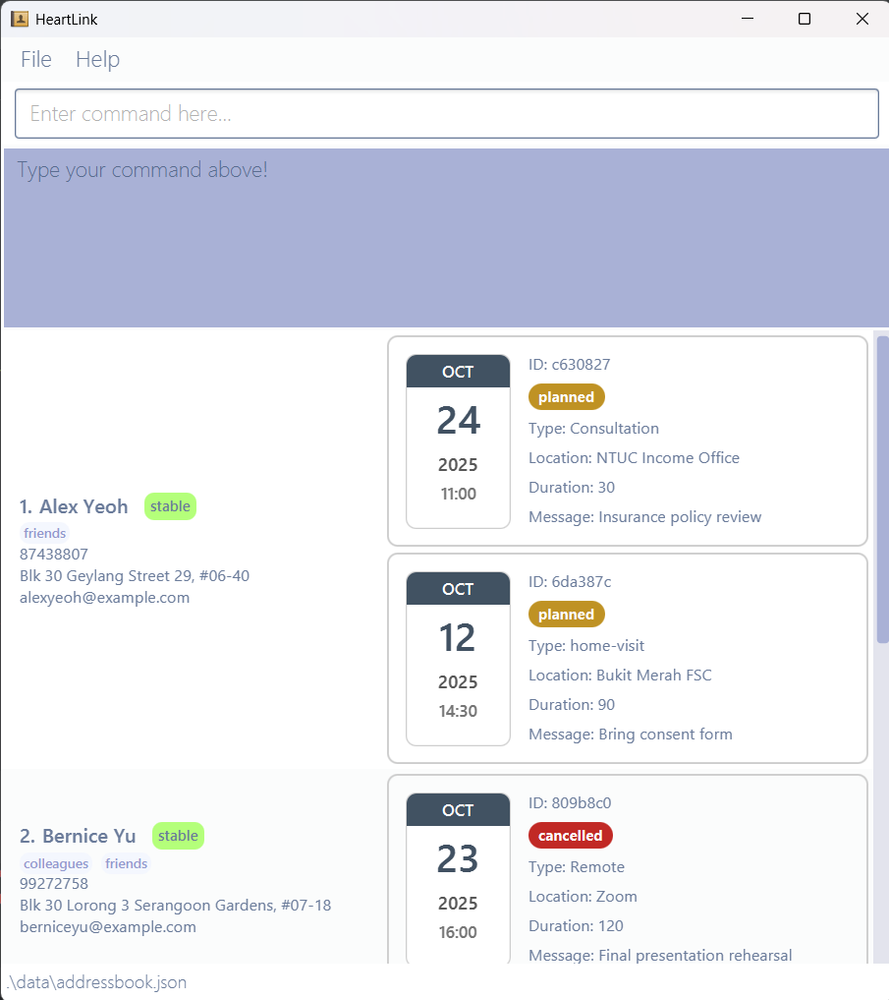

HeartLink is a **desktop app for managing contact details for Social Workers in Singapore. It is optimized for use via a Command Line Interface** (CLI) while still having the benefits of a Graphical User Interface (GUI). If you can type fast, HeartLink can get your contact management tasks done faster than traditional GUI apps.

    * Table of Contents
    {:toc}

--------------------------------------------------------------------------------------------------------------------

## Quick start

1. Ensure you have Java `17` or above installed in your Computer.<br>
   **Mac users:** Ensure you have the precise JDK version prescribed [here](https://se-education.org/guides/tutorials/javaInstallationMac.html).
   > **How to check if you have Java `17` or above?**<br>
    Click on start and search for Command Prompt/Terminal. Type `java -version` and click enter. You will see the 
    java version installed on your computer. 

    > **Don't have Java 17?** <br>
    Install it [here](https://www.openlogic.com/openjdk-downloads)!

2. Download the latest `.jar` file from [here](https://github.com/AY2526S1-CS2103T-T09-1/tp/releases).

3. Copy the file to the folder you want to use as the _home folder_ for HeartLink.

4. Run HeartLink using the `java -jar HeartLink.jar` command.<br>
   > **How to run HeartLink?** (for beginners) <br>
   > 1. Open start and search for Command Prompt or Terminal.
   > 2. Type `cd [filename]` to navigate to the folder with your HeartLink jar. <br>
   >  E.g. If your jar is in `Users\(name)\Downloads` and you are currently
   >  in `Users\(name)`, you will type `cd Downloads` in the terminal)
   > 3. Type `java -jar HeartLink.jar` and HeartLink will open!

    A GUI similar to the below should appear in a few seconds. Note how the app contains some sample data.<br>
    
    

5. Try typing some command in the command box and press Enter to execute it. <br> E.g. typing **`help`** and pressing Enter will open the help window.<br>
   Some example commands you can try:

   * `list` : Lists all contacts.

   * `add n/John Doe p/98765432 e/johnd@example.com a/John street, block 123, #01-01` : Adds a contact named `John Doe` to the Address Book.

   * `delete John Doe` : Deletes `John Doe` from the list of contacts.

   * `clear` : Deletes all contacts.

   * `exit` : Exits the app.

6. Refer to the [Features](#features) below for more features with its details.

--------------------------------------------------------------------------------------------------------------------

## Features

<div markdown="block" class="alert alert-info">

**:information_source: Notes about the command format:**<br>

* Words in `UPPER_CASE` are the parameters to be supplied by the user.<br>
  e.g. in `add n/NAME`, `NAME` is a parameter which can be used as `add n/John Doe`.

* Items in square brackets are optional.<br>
  e.g `n/NAME [t/TAG]` can be used as `n/John Doe t/friend` or as `n/John Doe`.

* Items with `…`​ after them can be used multiple times including zero times.<br>
  e.g. `[t/TAG]…​` can be used as ` ` (i.e. 0 times), `t/friend`, `t/friend t/family` etc.

* Parameters can be in any order.<br>
  e.g. if the command specifies `n/NAME p/PHONE_NUMBER`, `p/PHONE_NUMBER n/NAME` is also acceptable.

* Extraneous parameters for commands that do not take in parameters (such as `help`, `list`, `exit` and `clear`) will be ignored.<br>
  e.g. if the command specifies `help 123`, it will be interpreted as `help`.

* If you are using a PDF version of this document, be careful when copying and pasting commands that span multiple lines 
  as space characters surrounding line-breaks may be omitted when copied over to the application.
</div>

<br><br>
### List of commands:

<br>
<div markdown="block" class="alert alert-info">

**:information_source: Notes about the acceptable inputs:**<br>

* For NAME: Your input must be alphanumeric.
* For PHONE_NUMBER: Your input should only contain 8 digits starting with 6, 8 or 9. You may choose to include the `+65` country code at the start (not included in the 8 digits). <br>
  E.g. +6598765432 or 98765432.
* For EMAIL: Your input must be in this format `[LOCAL]@[DOMAIN].[TOP-LEVEL DOMAIN]`.
  The local and domain parts should be alphanumeric characters.
* For ADDRESS: Your input must be alphanumeric. Special characters like `# - , . ( ) / ; : &` are accepted.
* For TAG: Your input must be alphanumeric
* For RANK: You can only input four types of priority, “stable” , “vulnerable” , “urgent” and “crisis” (all case-insensitive).

</div>

### 1. Viewing help : `help`

Shows a message explaining how to access the help page.


Format: `help`


### 2. Adding a person: `add`

Adds a person to the address book.

Format: `add n/NAME p/PHONE_NUMBER [e/EMAIL] [a/ADDRESS] [r/RANK] [t/TAG]…​`

<div markdown="span" class="alert alert-primary">:bulb: **Tip:**
A person can have any number of tags (including 0)
</div>

Examples:
* `add n/John Doe p/98765432 e/johnd@example.com a/John street, block 123, #01-01 r/stable`
* `add n/Betsy Crowe t/friend e/betsycrowe@example.com a/Newgate Prison p/91234567 t/criminal`

### 3. Listing all persons : `list`

Shows a list of all persons in the address book.

Format: `list`

### 4. Editing a person : `edit`

Edits an existing person in the address book.

Format: `edit OLD_NAME [n/NEW_NAME] [p/PHONE] [e/EMAIL] [a/ADDRESS] [r/RANK] [t/TAG]…​`

* Edits the person at the specified `OLD_NAME`. The old name refers to the person's name before editing.
* At least one of the optional fields must be provided.
* Existing values will be updated to the input values.
* When editing tags, the existing tags of the person will be removed i.e adding of tags is not cumulative.
* You can remove all the person’s tags by typing `t/ ` without specifying any tags after it.
* You can use any combinations of the fields.

Examples:
*  `edit John Doe p/91234567 e/johndoe@example.com r/urgent`  
Edits the phone number and email address of John Doe to be `91234567`, `johndoe@example.com` respectively
and ranks the contact as `urgent`.
*  `edit Betsy Crownerrr n/Betsy Crower t/`  
Edits the name of the 2nd person to be `Betsy Crower` and clears all existing tags.

### 5. Look up clients by fields: `find`

```
find [n/KEYWORD_1 KEYWORD_2 ...] [p/PHONE] [e/EMAIL] [t/TAG] [r/RANK]
```
You can use this command to retrieve a list of clients that match the specified attributes:
- Name `n/KEYWORD_1 KEYWORD_2 ...` — lists all clients whose names contain any of the specified keywords.
The search is case-insensitive.
- Phone number `p/PHONE` - lists all clients whose phone numbers exactly match `PHONE`.
- Email `e/EMAIL` - lists all clients whose email exactly match `EMAIL`.
- Tag `t/TAG` - lists all clients whose tag contains `TAG`.
- Rank `r/RANK` - lists all clients whose rank exactly match `RANK`.

<div markdown="span" class="alert alert-info">:exclamation: **Remarks:**
The order of the attributes does not matter. If you haven't specified any attributes, the system will list all clients.
</div>

Example usage:

You want to list all urgent clients whose name contains "John" or "Doe.
```
find n/John Doe r/urgent
```

You want to list all clients with tag patients and phone number 81234567.
```
find p/81234567 t/patient
```

### 6. Look up appointments by fields `find`

```
find [appt/TIME] [status/STATUS] [type/TYPE]
```

You can use this command to retrieve a list of appointments
that match the specified attributes.

#### i. Appointment meeting time `TIME`

list all appointments that  overlap with the specified time. 
Here are the example usages.

List all appointments between 24th October 2025 10 - 11 am.
```
find appt/24-10-2025 1000 to 24-10-2025 1100
```
List all appointments on 4th July 2025.
```
find appt/04-07-2025
```
List today's appointment.
```
find appt/today
```

List all appointments in the upcoming three days.
```
find appt/+3
```

#### ii. Appointment status `STATUS`
List all appointments with the given status. For example,
you want to list all cancelled appointments, you can type
```
find status/cancelled
```

#### iii. Appointment type `TYPE`
List all appointments with the given type. For example,
you want to list all meetings with GIC. You can type
```
find type/GIC-Meeting
```

#### iv. Chaining commands
It is possible to chain these fields with [client fields](#head1234).
For example, if you want to find today's appointment for urgent clients, you can type
```
find r/urgent appt/today 
```

> Although the leading command to list appointments and clients is the same, the behavior differs depending on the fields provided.
If you include any appointment-related fields, such as `appt/`, `status/`, or `type/`, the system will list appointments.
However, providing client-related fields alone only trigger a client listing view instead.
For example,
> - `find r/urgent` will show list of all clients with their respective appointments.
> - `find r/urgent appt/today` will only show list of appointments.
>
> The order of the attributes does not matter. If you haven't specified any attributes, the system will list all clients.

### 7. Deleting a person : `delete`

Deletes the specified person from the address book.

Format: `delete INDEX`

* Deletes the person at the specified `INDEX`.
* The index refers to the index number shown in the displayed person list.
* The index **must be a positive integer** 1, 2, 3, …​

Examples:
* `list` followed by `delete 2` deletes the 2nd person in the address book.
* `find Betsy` followed by `delete 1` deletes the 1st person in the results of the `find` command.

### 8. Clearing all entries : `clear`

Clears all entries from the address book.

Format: `clear`

### 9. Exiting the program : `exit`

Exits the program.

Format: `exit`

<br><br>
### Other features:

### Saving the data

HeartLink data are saved in the hard disk automatically after any command that changes the data. There is no need to save manually.

### Editing the data file

HeartLink data are saved automatically as a JSON file `[JAR file location]/data/addressbook.json`. 

<div markdown="span" class="alert alert-warning">:exclamation: **Caution:**
If you are familiar with JSON, you are welcome to update data directly by editing that data file! <br>
However, do note that if the changes make the format invalid(e.g. values out of range, missing field), HeartLink will discard all data and start with an empty data file at the next run. 
Hence, it is recommended to take a backup of the file before editing it.<br>
</div>

--------------------------------------------------------------------------------------------------------------------

## FAQ

**Q**: How do I transfer my data to another Computer?<br>
**A**: 
> 1. Install the app in the other computer, say computer B.
> 2. On both computers, navigate to the folder with HeartLink.
> 3. Navigate to a folder named `data` and you will see a file called `addressbook.json` <br> 
(If you don't see it in computer B, you can either run HeartLink once or create the file manually)
> 4. Copy the contents of `addressbook.json` file from computer A (where your data is) to computer B.

--------------------------------------------------------------------------------------------------------------------

## Known issues

1. **When using multiple screens**, if you move the application to a secondary screen, and later switch to using only the primary screen, the GUI will open off-screen. The remedy is to delete the `preferences.json` file created by the application before running the application again.
2. **If you minimize the Help Window** and then run the `help` command (or use the `Help` menu, or the keyboard shortcut `F1`) again, the original Help Window will remain minimized, and no new Help Window will appear. The remedy is to manually restore the minimized Help Window.

--------------------------------------------------------------------------------------------------------------------

## Command summary

Action | Format, Examples
--------|------------------
**Add** | `add n/NAME p/PHONE_NUMBER [e/EMAIL] [a/ADDRESS] [r/RANK] [t/TAG]…​` <br> e.g., `add n/James Ho p/92248444 e/jamesho@example.com a/123, Clementi Rd, 1234665 t/friend t/colleague r/stable`
**Clear** | `clear`
**Delete** | `delete INDEX`<br> e.g., `delete 3`
**Edit** | `edit OLD_NAME [n/NEW_NAME] [p/PHONE_NUMBER] [e/EMAIL] [a/ADDRESS] [t/TAG]…​`<br> e.g.,`edit James Tan n/James Lee e/jameslee@example.com`
**Find** | `find KEYWORD [MORE_KEYWORDS]`<br> e.g., `find James Jake`
**List** | `list`
**Help** | `help`
